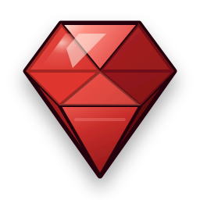

  

> A [r.uby.dev](https://r.uby.dev) project.

Welcome to the r.uby.dev website.

r.uby.dev is the home of the r.uby.dev chatbot — a friendly robot that
answers questions about [llm.rb](https://github.com/r-uby-dev/llm#readme)
and [mruby-llm](https://github.com/r-uby-dev/mruby-llm#readme). It is
connected to the live GitHub repositories of both projects, so it can read
READMEs, search the source code, and look up issues and pull requests. Its
answers are grounded in the real repositories rather than training data.

The chatbot is itself an llm.rb agent. It is backed by an ActiveRecord model
using [`acts_as_agent`](https://r.uby.dev/api-docs/llm.rb/LLM/ActiveRecord/ActsAsAgent.html#acts_as_agent-instance_method),
each visitor's session is serialized into a single database column, and
responses stream to the browser with the
[roda-sse](https://github.com/havenwood/roda-sse) plugin on top of the
[Roda](https://github.com/jeremyevans/roda) web toolkit.

## License

This software is released under the terms of the MIT license.  
See [LICENSE](./LICENSE) for details.
